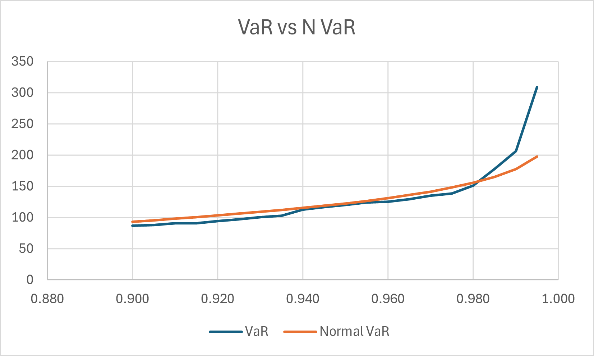

# Portfolio-Risk-Analysis-Excel

This project analyzes a **hypothetical portfolio** constructed from three major stock indexes: **S&P 500, FTSE 100, and DAX**, using **two years of historical data**. Relevant **exchange rates** were also included to account for currency effects.  

The raw data was **extracted from Google Sheets using GOOGLEFINANCE functions**, then **cleaned, converted, and prepared** for analysis. The project visualizes the **loss distribution** through a histogram, calculates statistical measures of risk, and constructs a **risk matrix** including **Value at Risk (VaR)** and **Expected Shortfall (ES)**.

Additionally, the **loss distribution is compared against Normal and t-distributions** to identify which distribution best models the portfolio. The impact of assuming each distribution on **VaR and ES estimates** is also analyzed. 
This project is inspired by the **Risk Management Specialization course on Coursera**.

## Method
1. Extract data from Google Sheets using the GOOGLEFINANCE function.
2. Clean, convert, and prepare data using Excel functions (e.g., VLOOKUP, date alignment, and filtering).
To ensure comparability, only trading days where all three markets (S&P 500, FTSE 100, DAX) were open were retained. Days with missing data due to holidays or closures in any index were removed.
3. Construct a hypothetical portfolio using the three indexes.  
4. Set up bins covering the full range of losses.  
5. Calculate relative frequencies for each bin.  
6. Create a histogram in Excel to visualize the loss distribution.  
7. Fit **Normal and t-distributions** to the loss data and compare which better models the portfolio.  
8. Compute statistical measures including:
   - Mean, standard deviation, kurtosis  
   - **Value at Risk (VaR)**  
   - **Expected Shortfall (ES)**  
   - Assess changes in VaR and ES under Normal vs t-distribution assumptions.  
9. Construct a **risk matrix** summarizing portfolio risk.

## Tools
- Microsoft Excel

## Results and Analysis
The historical trends of the three indexes (S&P 500, FTSE 100, and DAX) were first visualized to observe their movement over the two-year period. All three indexes showed an overall upward trend, reflecting general market growth. A noticeable downturn occurred in April 2025 across all three markets, followed by a gradual recovery.

A hypothetical portfolio was then constructed with an initial value of USD 10,000, consisting of 40% DAX, 30% S&P 500, and 30% FTSE 100. Portfolio values were calculated for 486 trading days, and daily portfolio losses were computed and visualized. The resulting loss distribution appeared approximately symmetric, resembling a normal distribution in shape.

However, the summary statistics indicated heavier tails than a perfect normal distribution:
| Statistic           | Value   |
| ------------------- | ------- |
| Number of scenarios | 486     |
| Minimum loss        | -325.97 |
| Maximum loss        | 599.74  |
| Mean                | -10.21  |
| Standard deviation  | 80.80   |
| Skewness            | 1.00    |
| Kurtosis            | 7.51    |

The positive skewness indicates occasional large gains, while the high kurtosis (greater than 3 for a normal distribution) suggests the presence of extreme loss events. This implies that the portfolio exhibits fat tails, meaning that a normal distribution may underestimate risk, especially in the tails of the loss distribution.

  
   
  <b>Figure 1:</b> Histogram of portfolio daily losses.

To assess how well different theoretical distributions describe the portfolio’s losses, a Normal distribution and a t-distribution were fitted. The Normal distribution was calculated using the standard normal density function, while the t-distribution parameters were estimated using the sample kurtosis. Both fitted distributions were then compared against the empirical histogram.

  
  

  <b>Figure 2:</b> Portfolio loss histogram with Normal distribution overlay. &nbsp;&nbsp;&nbsp;&nbsp;
  <b>Figure 3:</b> Portfolio loss histogram with t-distribution overlay.

### Normal Distribution Fit
The Normal distribution did not fully capture the shape of the empirical loss distribution. Between –50 and +50, actual losses were higher than Normal estimates, indicating more frequent moderate losses than the model predicts. Beyond this range, the Normal model overestimated the likelihood of extreme outcomes on both sides. Moreover, the Normal distribution fails to capture some extreme losses and gains observed in the empirical data. These tail points lie beyond the range predicted by the Normal model, indicating that rare, high-impact events are more likely than a Normal assumption would suggest. This highlights the importance of using a fat-tailed distribution, such as the t-distribution, for more accurate risk assessment of the portfolio. Overall,this suggests that the portfolio’s loss distribution is more peaked and has heavier tails than a perfect Normal curve, implying that the Normal assumption may underestimate risk in certain regions.

### t-Distribution Fit
The t-distribution provided a better fit for the portfolio loss distribution compared to the Normal distribution. In the central region (–50 to +50), actual losses were slightly higher than predicted, while in the tails, the t-distribution captured most of the extreme losses that the Normal model missed. However, one very extreme loss near +600 was still not fully addressed, illustrating that even fat-tailed distributions may underestimate truly rare, high-impact events.

### Portfolio VaR and ES
Value at Risk (VaR) and Expected Shortfall (ES) were calculated for confidence levels ranging from 90.0% to 99.5% using the PERCENTILE.EXC function in Excel. For general analysis and discussion, a 95% confidence level was used as a reference. As expected, higher confidence levels correspond to higher VaR and ES, because we are examining more extreme losses further in the tail of the distribution. ES is consistently higher than VaR, as it represents the average of losses beyond the VaR threshold, capturing tail risk more effectively. This demonstrates how extreme losses increase rapidly in the tails of the portfolio loss distribution.

  
  

  <b>Figure 4:</b> Change of VaR with lower and upper CI levels. &nbsp;&nbsp;&nbsp;&nbsp;
  <b>Figure 5:</b> Change of VaR and ES.

### Comparison of Normal and Empirical VaR/ES
VaR and ES were calculated under both the empirical loss distribution and the Normal distribution assumption. For confidence levels below 98%, empirical VaR is slightly smaller than Normal VaR, whereas for confidence levels above 98%, empirical VaR exceeds the Normal VaR, reflecting the fat tails of the portfolio loss distribution. Empirical ES is consistently higher than Normal ES across all confidence levels, highlighting that the Normal assumption underestimates average losses in the tail, and emphasizing the importance of fat-tailed models for accurate risk assessment.

  
  

  <b>Figure 6:</b> Comparison between VaR and Normal VaR. &nbsp;&nbsp;&nbsp;&nbsp;
  <b>Figure 7:</b> Comparison between ES and Normal ES.

### Comparison of t-Distribution and Emperical VaR
Value at Risk (VaR) was also estimated using the t-distribution, which accounts for the fat-tailed nature of the portfolio loss distribution. The t VaR values are closer to the empirical VaR than those based on a Normal assumption, particularly at higher confidence levels. This demonstrates that the t-distribution better captures extreme losses than the Normal distribution. However, t VaR still slightly underestimates the most extreme losses in the far tail, highlighting that rare, high-impact losses may exceed model predictions.

  
   
  <b>Figure 8:</b> Comaprison between VaR and t VaR.

## Actionable Insights

**Adopt fat-tailed risk models:** The t-distribution provides a more realistic representation of portfolio risk than the Normal distribution. Risk managers should prefer fat-tailed models when calculating VaR and ES to better capture extreme losses.

**Use Expected Shortfall for capital planning:** Since ES captures tail risk more effectively than VaR, it should be the preferred measure for setting capital reserves and stress testing.

**Monitor changing market volatility:** Observed kurtosis suggests dynamic risk conditions. Continuous monitoring of volatility and updating model parameters regularly will improve forecast reliability.

## Extensions and Alternative Approaches
Beyond Normal and t-distributions, other approaches such as weighted historical VaR, and extreme value methods can be used to capture time-varying volatility and fat tails. Analyses can also be repeated across different time scales (daily, weekly, monthly) to observe how risk measures change with aggregation. Comparing these methods allows for a more robust assessment of portfolio risk and highlights the impact of extreme events and distributional assumptions.

## Refection
This project enhanced my understanding of risk modeling and the importance of aligning statistical findings with actionable business outcomes.
